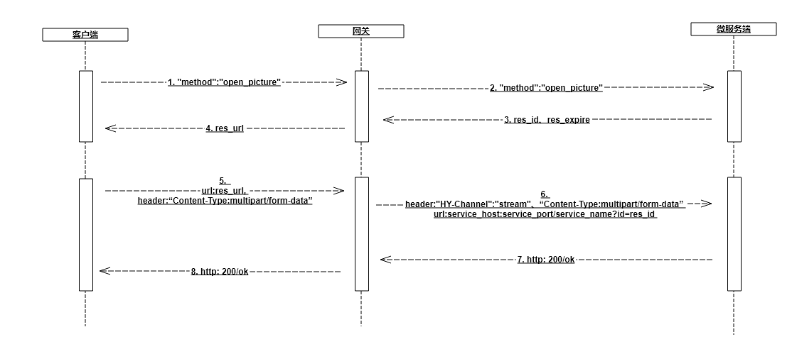
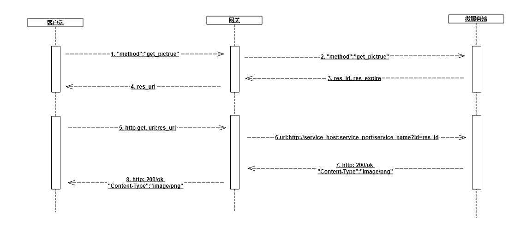

= Weforward Protocol

Weforward Protocol 定义了一套微服务的协议标准

== ·名词约定与规范

[options="header"]
|===
名称|说明|规范

|微服务名
|微服务的唯一标识
|小写字母+下划线+数字+点。如：user、order_center、wechat.pay

|微服务实例编号
|同一服务，不同实例间的标识
|小写字母+数字，长度不大于10

|微服务构建版本号
|微服务的构建版本信息
|数字+点号的固定格式：主版本号.次版本号.打包号.修订号，如：1.0.1.12345。
主版本号更改规则：微服务重构无法兼容现在版本，或者有重大改动；
次版本号更改规则：微服务迭代（增加新功能）；
打包号更改规则：由打包脚本自动加一；
修订号更改规则：提取svn/git中的版本号

|微服务版本号
|微服务的版本信息
|构建版本号的主、次版本号

|微服务最低兼容版本号
|此微服务版本向下兼容的最低版本号
|构建版本号的主、次版本号

|方法名
|微服务的方法名称
|小写字母+下划线+数字+斜杠，斜杠用于表示分层，如：get_user，order/submit，order/commit

|参数、返回值名
|方法的参数与返回值的字段名称
|小写字母+下划线+数字，如：user_name

|微服务的错误码
|方法未成功执行时，返回的错误标识
|纯数字。
10000~99999为Weforward统一约定的错误码；
100000~999999为自定义错误码

|===

== ·数据类型

类型仅包括：数字（Number）、字串（String）、布尔值（Boolean）、日期（Date）、对象（Object）、列表（List）。

其中，日期（Date）是采用GMT时间格式（符合rfc3339规范）表示的字串（String）类型，格式：yyyy-MM-dd'T'HH:mm:ss.SSS'Z'，如2019-10-29T00:30:00.666Z

== ·基于Http(s)的微服务调用

=== ··链接

格式：http://{gateway_host}:{gateway_post}/{service_name}

	说明：
	gateway_host：网关域名或IP地址
	gateway_post：网关端口
	service_name：微服务名称

=== ··协议头

Content-Type：内容格式与编码。取值：application/json;charset=utf-8

WF-Noise：长度为16，包含小写字母与数字，且不重复的字串

WF-Content-Sign：POST内容体的SHA256签名的base64字串

	生成过程：
	a)Charset(POST内容体)，使用协议头声明编码方式对POST内容体编码，得到编码后的字节数组post_data；
	b)SHA256(post_data)，得到post_sign；
	c)空内容体也签名，签名值固定为：;
	d)Base64.encode(post_sign)，得到最终的base64字串

WF-Tag：表示处理当前请求的微服务实例标识，下次请求带上此标识，网关将优先使用此标识对应的实例

WF-Channel：信道类型。取值：rpc、stream、notify、topic

* rpc：远程过程调用。
* stream：数据流。在此信道下，直接传输原始数据内容，用于上传、下载文件的场景。
* notify：通知。支持单点与广播模式，与 `rpc` 不同的是，当通知请求抵达微服务实例时，网关将立即响应调用端，不等待微服务端处理。
* topic：主题消息广播。代替MQ的订阅，与邮件列表（mailing list）类似，订阅方不需要与MQ建立通讯。请求格式与 `rpc` 有所差别，<<channel_topic,详见下文>>。

WF-Secure：标识通信链路是否安全，取值：on/off。Weforward保留，无需调用端传递。

Authorization：验证类型。取值：WF-None、WF-SHA2、WF-AES。

* WF-None：不验证。格式：Authorization: WF-None
* WF-SHA2：基于SHA2-256的签名验证。格式：Authorization: WF-SHA2+空格+access_id:sign

	sign生成过程：
	a)按以下顺序拼接字串，过滤空项：
	{service_name}+{access_id}+{access_key}+{WF-Noise}+{WF-Tag}+{WF-Channel}+{WF-Content-Sign}
	b)对已上的字串进行SHA256签名，得到sign_data
	c)Base64.encode(sign_data)，得到最终的base64字串
	---------------
	示例：
	service_name = test
	access_id = H-123456-12345678
	access_key = u9Qa6Ggo9s6mWVs58hr3ZAIKUWzuV3u+gysmCbLeYWs=
	WF-Noise = a34f2b5e9077dd05
	post内容体 = {"test":"abc"}
	WF-Content-Sign = o08rXpB33QV3Qt4uoZnHMS30xSp1mXC88IzsrOEp+ck=
	WF-Tag = 无
	WF-Channel = 无
	字串拼接：
	testH-123456-12345678u9Qa6Ggo9s6mWVs58hr3ZAIKUWzuV3u+gysmCbLeYWs=a34f2b5e9077dd05o08rXpB33QV3Qt4uoZnHMS30xSp1mXC88IzsrOEp+ck=
	Sha256签名并按base64编码：
	adxB3I/5ZajvsCKzmJP1SBZTcrORjRvmkk5TJ+DVi5c=

* WF-AES：待定

=== ··请求体

格式。需要保证`wf_req`为第一个节点

[source,json]
----
{
	"wf_req": {
		"ver":"1.0",
		"res_id":"File$abc123",
		"trace_token":"1234567890abcdef",
		"wait_timeout":60
	},
	"invoke": {
		"method": "methodA"
		"params": {
			"param1": "value1"
		}
	}
}
----

字段说明

[options="header"]
|===
名称|说明|必需

|wf_req
|Weforward框架请求节点
|是

|ver
|指定微服务版本号
|否

|res_id
|资源标识（由微服务定义）
|否

|res_right
|调用方（客户端）对‘res_id’的权限，由网关调用微服务时传入。
|否

|trace_token
|跟踪微服务调用的令牌，由网关调用微服务时传入。微服务在此次调用中继续调用其他微服务时，需将此token传给网关
|否

|wait_timeout
|客户端等待网关响应时间，单位：秒
|否

|client_access
|调用方（客户端）的access id，由网关调用微服务时传入。
|否

|client_addr
|调用方（客户端）的ip地址，由网关调用微服务时传入。
|否

|tenant
|租户标识。调用方（客户端）的access所属租户的标识，由网关调用微服务时传入。
|否

|openid
|基于OAuth协议生成的用户身份标识。调用方（客户端）的access基于OAuth协议生成时，通常带有openid，由网关调用微服务时传入。
|否

|marks
|标识。详见下表
|否

|invoke
|微服务的调用信息节点
|是

|method
|调用的方法名称
|是

|params
|调用的方法参数
|否

|===

wf_req标识表。 +
标识的值由2进制的位(bit)按“或运行”叠加而成，每一位表示一个Boolean值。

[options="header"]
|===
位(bit)|Boolean值说明

|1<<0
|请求支持转发

|1<<1
|通知使用广播模式（配合<code>notify</code>信道使用）

|===

=== ··响应体

格式。需要保证`wf_resp`为第一个节点

[source,json]
----
{
	"wf_resp": {
		"wf_code": 0,
		"wf_msg": "",
		"res_url":"https://xxxx/"
	}
	"result": {
		"code":0,
		"msg":"",
		"content":{}
	}
}
----

字段说明

[options="header"]
|===
名称|说明|必需

|wf_resp
|Weforward框架响应节点
|是

|wf_code
|Weforward网关响应码。取值见下文
|是

|wf_msg
|Weforward网关响应码说明
|是

|res_id
|微服务的资源标识
|否

|res_expire
|微服务的资源到期时间。取值：自1970年1月1日起的秒数，0表示永不过期
|否

|res_url
|微服务资源的访问链接
|否

|res_service
|资源所在的微服务
|否

|forward_to
|转发请求至此编号的实例。‘wf_code’为5006时，此值有效；若为空，网关将根据流量规则转发到其他实例。
|否

|marks
|标识。详见下文
|否

|result
|微服务的响应信息节点
|是

|code
|微服务的方法响应码。取值由微服务约定
|是

|msg
|微服务的方法响应码的说明
|是

|content
|微服务的方法返回内容
|否

|===

wf_code表

[options="header"]
|===
值|说明

|0
|成功

|1001
|Access Id 无效

|1002
|验证失败

|1003
|验证类型无效

|1101
|序列化/反序列化异常（内容格式解析异常）

|1102
|无效请求内容

|1501
|拒绝调用

|2000
|网关API不存在

|2001
|（网关与调用端之间的）网络异常

|2002
|网关忙

|5001
|微服务不存在

|5002
|微服务调用异常

|5003
|微服务忙

|5004
|微服务不可用

|5005
|微服务响应超时（已收到请求，但未在限制时间内返回）

|5006
|微服务请求转发

|5007
|微服务调用栈过深

|5008
|微服务连接失败

|9001
|内部错误

|9003
|未就绪

|9999
|未知异常

|===

wf_resp标识表。 +
标识的值由2进制的位(bit)按“或运行”叠加而成，每一位表示一个Boolean值。

[options="header"]
|===
位(bit)|Boolean值说明

|1<<0
|指示网关返回此微服务实例的标识给调用方，后续调用将优先访问此实例

|1<<1
|指示网关清除调用方所持有的微服务实例标识

|===

[[channel_topic]]
=== ··topic信道

链接格式：http://{gateway_host}:{gateway_post}/{service_name1};{service_name2}

	说明：
	使用英文半角分号“;”拼接多个微服务名

请求体中，`method` 固定为 `topic` ，`params.id` 为消息标识， `params.topic` 为消息主题， `params.tag` 为消息标签， `params.deliver` 为投递此消息的服务名，`params.content` 为消息内容

[source,json]
----
{
	"wf_req": {
		"ver":"1.0",
		"res_id":"File$abc123",
		"trace_token":"1234567890abcdef",
		"wait_timeout":60
	},
	"invoke": {
		"method": "topic"
		"params": {
			"id": "1",
			"topic": "order_status",
			"tag": "success",
			"deliver": "weforward_mq",
			"content":{}
		}
	}
}
----

响应体无 `result` 节点

[source,json]
----
{
	"wf_resp": {
		"wf_code": 0,
		"wf_msg": "",
		"res_url":"https://xxxx/"
	}
}
----

=== ··Proxy客户端使用

定义接口

[source,java]
----
public interface MyTestMethods {
	public String helloWorld();
}
----
	
构造代理类
	
[source,java]
----
String preUrl = "http://127.0.0.1:5661/";
String accessId = "ACCESSID";
String accessKey = "ACCESSKEY";
ServiceInvokerProxyFactory factory = new ServiceInvokerProxyFactory(preUrl, accessId, accessKey);
ServiceInvokerProxy proxy = factory.openProxy("test");
MyTestMethods methods = proxy.newProxy(MyTestMethods.class);
methods.helloWorld();
	
----

以上二段代码构造了一个客户端的调用类，最终调用了test微信服务的my_test/hello_world方法

默认情况下newProxy会根据接口回自动加上方法组名，如上面的MyTestMethods对应的方法组为my_test/，即XXXMethods方法会对应XXX/组。
如果需要自行指定组，则可以使用newProxy(String methodGroup, String myInterface)指定方法组名，如果为null则相当于没有方法组。

MyTestMethods为对应接口组的接口
定义的方法名对接微服务的方法名，如微服务提供一个hello_world的方法，则接口定义一个helloWorld方法即可调用到指定的微服务方法

方法的返回值可以为:基本数据类型,String,Data,DtBase,FriendlyObject,List,ResultPage,BigInteger,BigDecimal.
其它类型均示为JavaBean对象，自动通过set方法注入对应数据

方法的入参可选类型为DtOjbect,FriendlyObject和JavaBean类.
JavaBean类自动调用get方法传对应数据
如:API为

[source,json]
----
方法名： /user_service/gen_verify_image

参数：
{
	"key": "111"
}

返回值：
{
	"key":"111",
	"image":"222"
}
	
----

则对应接口定义为

[source,java]
----
public interface UserServiceMethods {
	/**
	 * 获取验证码
	 * 
	 * @param params
	 * @return
	 */
	VerifyImageView genVerifyImage(VerifyImageParam params);

	class VerifyImageParam {

		public String key;

		public VerifyImageParam(String key) {
			this.key = key;
		}

		public String getKey() {
			return key;
		}

	}

	class VerifyImageView {

		public String key;

		public String image;

		public void setKey(String key) {
			this.key = key;
		}

		public String getKey() {
			return key;
		}

		public void setImage(String image) {
			this.image = image;
		}

		public String getImage() {
			return image;
		}
	}
}
	
----

== ·基于Http(s)的文件上传与下载

上传、下载时需要传输大量的数据，直接使用rpc信道需要对数据内容进行编码（如：base64），编码后数据量增加，造成带宽浪费。 +
所以须将上传、下载过程分为两步，第一步通过rpc方法获取到文件url；第二步使用“Content-Type:multipart/form-data”上传文件到此url，或使用"Get"请求此url获取文件内容。

*上传过程：* +

1.客户端调用微服务的“open_picture”（名称由微服务自定义）方法； +
2.微服务端收到调用； +
3.微服务端开辟一个图片资源存储空间，并返回资源标识 `res_id` ，资源过期时间 `res_expire` （客户端需要在过期之前上传）； +
4.客户端收到 `res_url` ； +
5.客户端构建表单（Content-Type:multipart/form-data），上传文件到 `res_url` ； +
6.网关对微服务发起http请求，链接如：http://service_host:service_port/service_name?id=res_id ，请求头包含"WF-Channel":"stream"、"Content-Type":"multipart/form-data"； +
7.微服务端根据 `res_id` 保存上传内容，并返回http状态码200； +
8.网关返回http状态码200

*下载过程：* +

1.客户端调用微服务的“get_picture”（名称由微服务自定义）方法； +
2.微服务端收到调用； +
3.微服务端找到图片资源，并返回资源标识 `res_id` ，资源过期时间 `res_expire` （客户端需要在过期之前下载）； +
4.客户端收到 `res_url` ； +
5.客户端使用GET方式，请求 `res_url` ； +
6.网关对微服务发起http请求，链接如：http://service_host:service_port/service_name?id=res_id ； +
7.微服务端根据 `res_id` 找到图片资源，按资源实际内容构建content-type，响应200状态，并输出资源内容； +
8.网关返回资源内容给客户端

